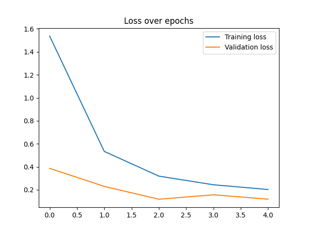
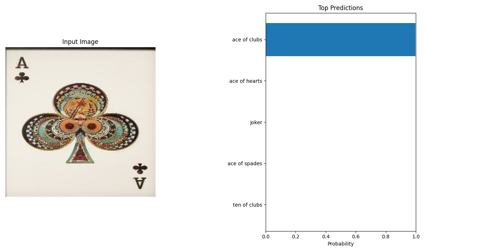
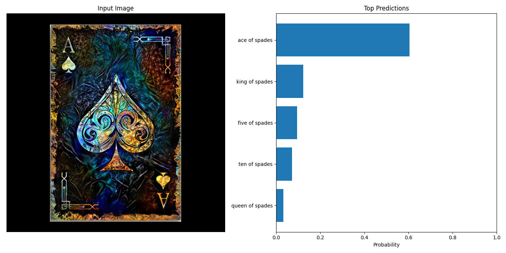

# PyTorch Card Recognizer

This is an introductory project that uses **PyTorch** and **EfficientNet** to classify playing cards from images.  
It is designed to demonstrate end-to-end training and inference of an image classifier, with clean architecture and custom dataset support. This project was done with the help of online tutorials and resources.

---

## Overview

This repository includes:
- A **training pipeline** with EfficientNet-B0 using `timm`
- A **custom dataset class** using `ImageFolder`
- **MPS (Metal)** support for fast training on macOS
- Visualization of **training and validation loss**
- A script for **inference** and prediction confidence visualization

The model architecture uses:
- **EfficientNet B0** as a base feature extractor
- A custom **linear classifier head**
- **53 output classes**, including all playing cards and jokers

---

## Modules / Libraries

- **PyTorch** — model training, custom datasets, inference
- **Torchvision** — image preprocessing and dataset loading
- **Timm** — transfer learning with pretrained EfficientNet
- **Matplotlib** — data and prediction visualization
- **NumPy / Pandas** — tensor operations and data handling

---

## Training
- This is trained on a public cards dataset on Kaggle, you can access it at the link [here](https://www.kaggle.com/datasets/surajguru/playing-card-dataset).
- It is also possible to substitute a new dataset if you would like.

# 🇯🇵 PyTorch カード識別器

このプロジェクトは、**PyTorch** と **EfficientNet** を使用して、画像からトランプの種類を分類する入門的なAIアプリケーションです。  
エンドツーエンドの画像分類ワークフロー（学習から推論まで）を体験することを目的としており、簡潔な構成とカスタムデータセットに対応しています。  
本プロジェクトは、オンラインのチュートリアルや資料を参考にしながら作成されました。

# 概要

このリポジトリには以下の内容が含まれます：
- `timm` を用いた EfficientNet-B0 の **学習パイプライン**
- `ImageFolder` を使った **カスタムデータセットクラス**
- macOS の **MPS (Metal)** による高速トレーニングの対応
- **学習・検証ロスの可視化**
- **推論と予測信頼度の可視化スクリプト**

モデル構成：
- 特徴抽出器として **EfficientNet B0**
- 独自の **線形分類ヘッド**
- **全53クラス**（ジョーカーを含むすべてのトランプの種類）に対応

## 使用ライブラリ

- **PyTorch** — モデルの学習、カスタムデータセット、推論処理
- **Torchvision** — 画像前処理、データローディング
- **Timm** — EfficientNet を用いた転移学習
- **Matplotlib** — ロス曲線や予測結果の可視化
- **NumPy / Pandas** — テンソル演算、データ処理

## 学習について

- このモデルは Kaggle に公開されているトランプ画像データセットを用いて学習されました。データセットは[こちら](https://www.kaggle.com/datasets/surajguru/playing-card-dataset)から取得できます。
- データセットを入れ替えることで、他の画像分類タスクにも応用可能です。

# Data Visualization (データ可視化)

Below are the graphs from training the model and asking it to identify the cards' identities in the testing dataset.
The first one is from `cardrecognition.py`, the other three are from `predictcard.py`. Predictions 1 nd 2 are sourced from the provided `cards_dataset` while the third prediction was a randomly selected image from the internet.

以下は、学習中の損失曲線やテストデータに対する予測結果の可視化です。  
最初のグラフは `cardrecognition.py` で出力されたもので、残りの3枚は `predictcard.py` による予測画像です。  
予測1と2は提供された `cards_dataset` から取得された画像に基づいており、予測3はインターネット上からランダムに取得した画像を使用しています。

