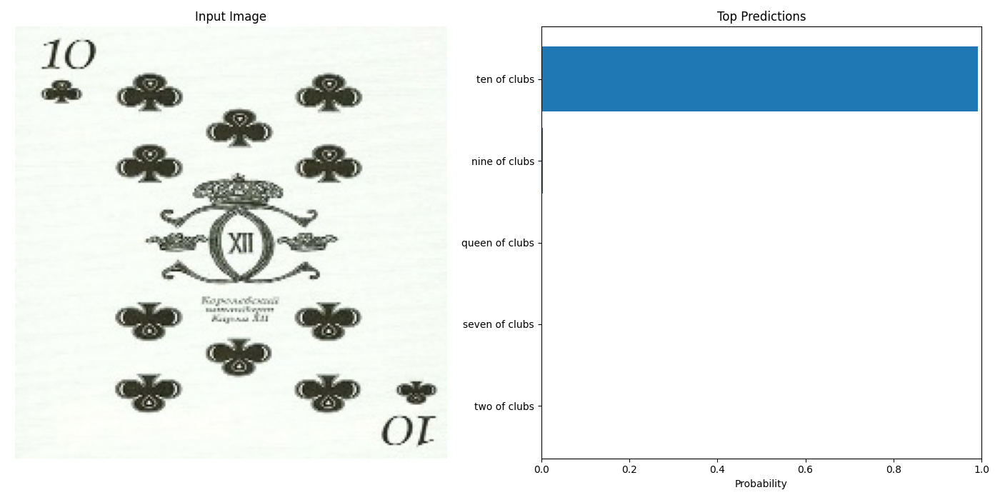

# PyTorch Card Recognizer

This is a introductory project uses **PyTorch** and **EfficientNet** to classify playing cards from images.  
It is designed to demonstrate end-to-end training and inference of an image classifier, with clean architecture and custom dataset support.

---

## Description

This repository includes:
- A **training pipeline** with EfficientNet-B0 using `timm`
- A **custom dataset class** using `ImageFolder`
- **MPS (Metal)** support for fast training on macOS
- Visualization of **training and validation loss**
- A script for **inference** and prediction confidence visualization

---

## Model Overview

The model architecture uses:
- **EfficientNet B0** as a base feature extractor
- A custom **linear classifier head**
- **53 output classes**, including all playing cards and jokers

---

## Data Visualization

Below are the graphs from training the model and asking it to identify the identities of the cards in the testing dataset.

